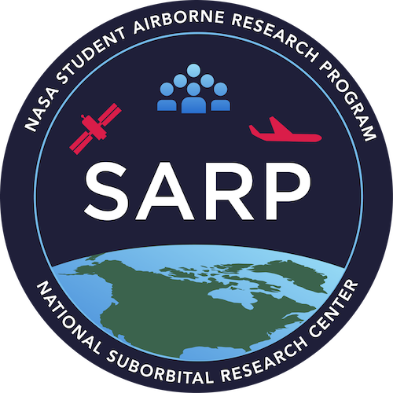

# SARP Lessons

SARP lessons is growing and has moved to the [NASA-SARP organization](https://github.com/NASA-SARP)! We are excited that the resource is improving over time. 

The SARP lessons jupyter book can still be accessed at [https://nasa-sarp.github.io/sarp_lessons/index.html](https://nasa-sarp.github.io/sarp_lessons/index.html).

Happy coding!

(_Dev note: Redirect code generated using https://dev.to/steveblue/setup-a-redirect-on-github-pages-1ok7 Still need to setup action and deploy_)
